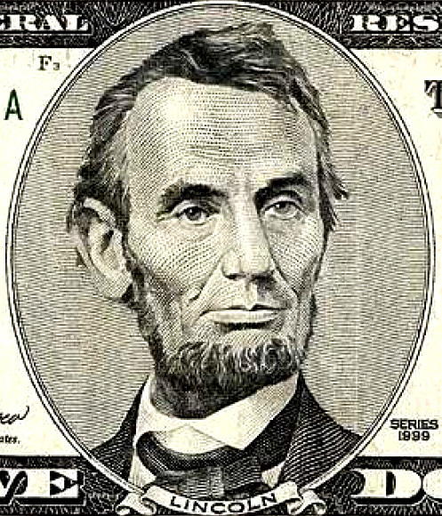
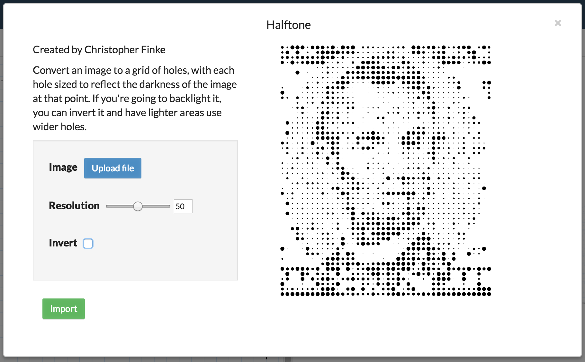
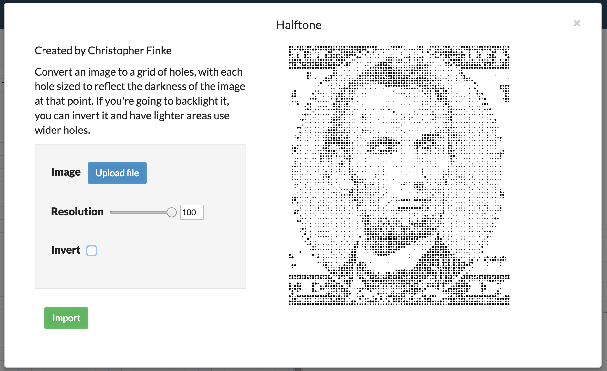
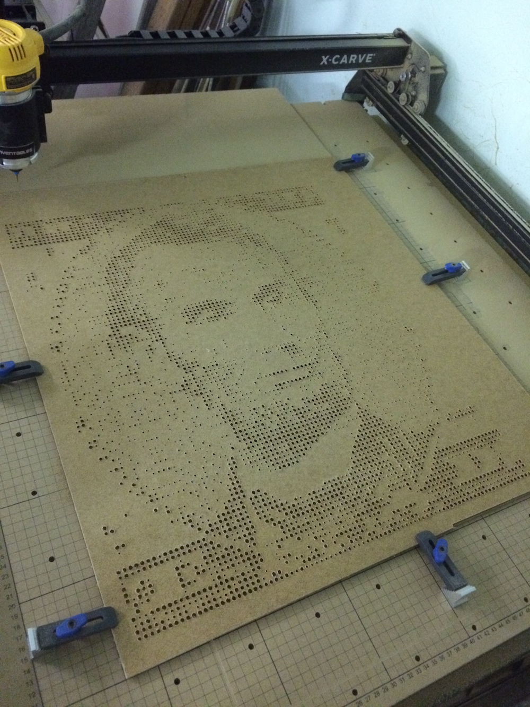

Halftone
========
Halftone is an app for making halftone-style carves with Inventables's Easel CNC design platform.

Upload an image and it will convert it to a grid of holes with each hole sized to reflect the brightness of the image at that point. Darker areas become wider holes, or if you're going to backlight it, you can invert it and have lighter areas use wider holes.

The `resolution` parameter determines the maximum number of holes that can be cut across the image's widest dimension.

Example
=======

Choose an image to upload:

Halftone will generate the appropriate cuts at the default resolution.

Increase the resolution to raise the number of holes that will be carved.

The carved result of running Halftone on the above image at a resolution of 100. This carve used a 1/16" bit, so any holes smaller than that were skipped.

